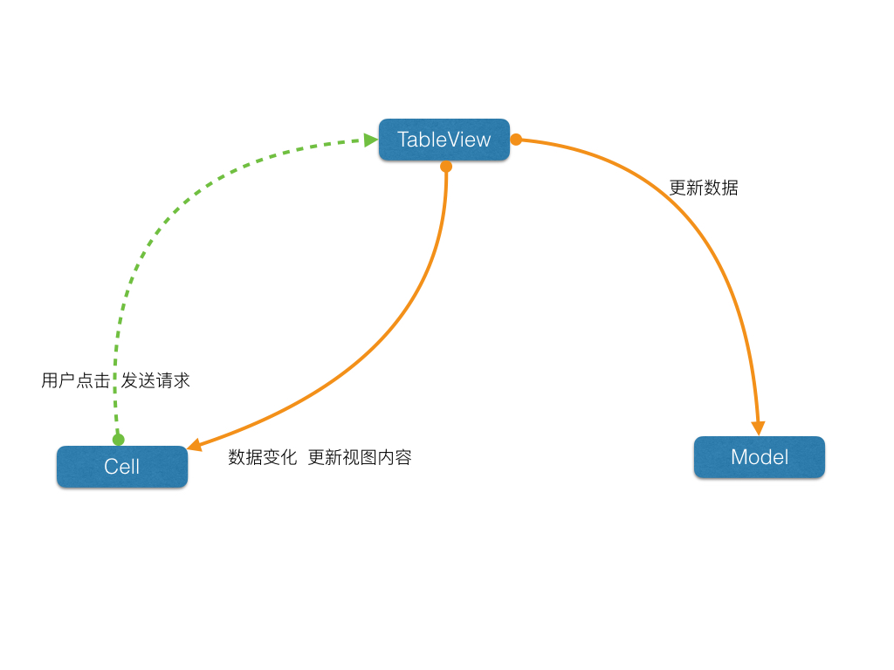
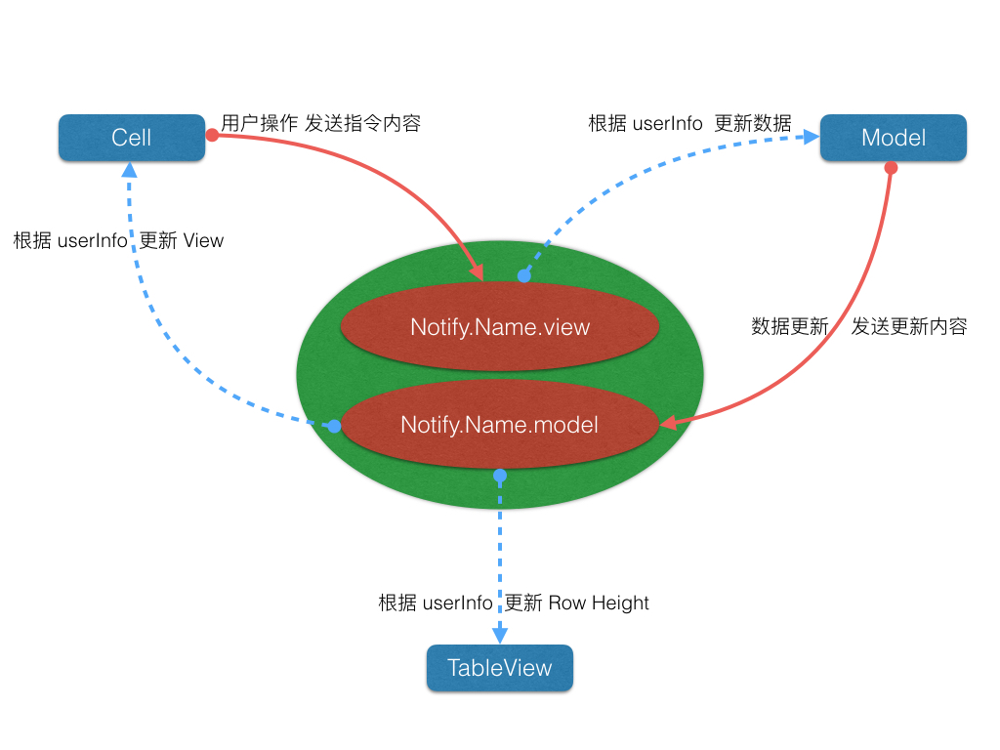

在开始写这篇文章之前，我就已经隐隐然的感觉到了，这将会是我挖下去的另一个坑。

我试着去了解 RxSwift 的时候，对于那种只需要几行代码的设置，然后就可以接收到各种原来需要使用代理才能收到，并且还要仔细考虑线程问题的做法，感觉真是 awesome！！！

所以，我也想，能不能，也模拟一下这种做法。有一种简单的方式，能让一个对象，向一个，或多个对象发送消息。

假设一种很常见的场景：



* TableView: 在这里扮演者 Controller 的角色。接收作为 View 的 Cell 发送过来的用户操作指令，进行数据操作，然后把数据保存到 Model 当中，再要求 Cell 更新视图。
* Cell: 作为 View 存在，展示数据和动画。
* Model: 存储数据

但是这样一来，大多数的逻辑都会落到 Controller 中，如果程序逻辑比较复杂，就会出现 Controller 极其臃肿的情况。之所以要使用 TableView 而不是直接 Controller，是为了等会不会直接把它给排除了。

图上并不能看出来这有多复杂，甚至有人会觉得，完全可以把视图变化那一块直接放到 View 当中，可是，假如这是一个涉及到网络等情况的应用，那么，View 的变化就会多了一个很重要的时机控制了。

而如果使用通知中心，程序的结构就会变成这样：



现在，他们三个的功能就会变成这样：

* TableView: Controller 角色，控制 Cell 的高度。在其他场景下，他可能会做诸如协调各个视图之间关系的动画之类的。它会从通知中心接收到数据变化通知，然后进行布局。
* Cell: View 角色，展示数据，动画。从通知中心接收到数据变化通知，然后更新视图。用户操作的时候，向通知中心发送消息。
* Model: 从通知中心接受指令，然后进行数据运算。数据变化的时候向通知中新发送消息。

这下，各个角色之间的耦合度已经非常低了。只要一些简单的协议，约定好相互之间所发送的数据结构。那么完全可以分开进行开发，各个模块专注于自己的所要做的事情。将可以有效的增加代码的可读性。

# 背景知识

NSNotification

主要的日常应用集中在三类方法中。

* addObserver 添加观察者
* removeObserver 移除观察者
* post 发送消息

贴上常用的方法：

```
public func addObserver(observer: Any, selector aSelector: Selector, name aName: Notification.Name?, object anObject: Any?)

public func post(name: Notification.Name, object: Any?, userInfo: [AnyHashable: Any]?)
    
public func removeObserver(observer: Any, name aName: Notification.Name?, object: Any?)
```

广播发送者和接收者之间靠两个要点来联系：

* name: 广播名称，或者说频道，在 Swift 3.0 之前都是一个 String，但是在 3.0 开始，就变成了特定的类型 Notification.Name，虽然本质上依然是字符串。
	* 可以通过 extension Notification.Name 来添加广播频道。
* object: 添加广播时指定的对象
	* 如果不指定，则会接收所有对象在这个频道的消息，如果指定，则只接受特定对象的。

通过广播传递数据时，也有两个要点要注意：

* queue: 线程，广播的线程是由广播发送时所在的线程决定的。因此想要控制线程，有两个位置可以处理
	* post
	* selector
* userInfo: 信息，用于传递数据。

# 思考

* 我可能会把他运用到以下几个方面：
	* 视图监听数据变化
	* 控制器监听应用状态变化
	* 数据监听网络变化
	* 数据监听视图变化
	* 同时对应用多个层次的功能进行控制(夜间模式)

>感觉这就很 MVVM 了。但是别纠结这个了，只要代码简洁易懂，逻辑清晰明确，那就是好架构。

## 广播名称

通常我们在工作中应该是根据具体的事务指定一个频道名称的，但既然我们现在要封装一个工具，至少也需要做几个通用的频道。

* Network 网络频道，处理网络相关的广播
* View    视图频道，处理视图变化的广播
* Model   模型频道，处理数据变化的广播
* Default 默认真是一个很讨人喜欢的词……只要它能把工作做好，默认就是最好的。

## userInfo

[AnyHashable: Any]? 是个好东西，但是每一次都要跟解压数据会比较麻烦，可以参考 Json 解析的方法，封装成一个可以快捷访问的对象。

因此可以约定几个常见的数据，默认这些广播传递的信息中会存在，比如：

* code(Int): 网络返回，数值变化。状态码本身就是一种可以自由约定的绝大可能了。
* message(String): 字符串信息。

## 调用方式

* 使用一个单例提供方法进行调用。
* 建立某个基类，或扩展 NSObject 提供方法。
* 使用 Protocol 以及 Extension 提供方法。

这三种方法孰胜孰劣我就不在这里仔细讲了，我个人很喜欢面向协议编程的范式。

# 实现

## 接口

* struct Notify.Name 在 Notify 类中添加 Name 结构，并设定几个默认值，后期也通过对齐的扩展添加频道，以此避免与其他项目扩展的 Notification.Name 冲突
	* static let Network: Notification.Name
	* static let View   : Notification.Name
	* static let Model  : Notification.Name
	* static let Default: Notification.Name

* protocol NotifyProtocol 

* extension NotifyProtocol 扩展协议并提供默认方法，这样一来只要准守该协议的类就自动拥有这个方法了。
	* func observer(...) 添加监听
	* func unobserver(...) 移除监听
	* func post(...) 发送消息

* class Notify 主类，用来帮忙解析 userInfos
	* Property
		* private let notification: Notification
		* var name: String { get }
		* var object: Any? { get }
		* var code: Int = -1000
		* var message: String = "Error: no message."
	* Init
		* init(notify: Notification)
	* Analysis Methods
		* func type<T>(...) -> T 根据 Key 返回值
		* func type<T>(...) -> T?
	* Class Tool Methods 提供一些便捷方法生成 code message
		* static let code: String = "notify.myron.userinfo.code"
		* static let message: String = "notify.myron.userinfo.message"
		* class func info(...) -> [AnyHashable: Any]


## 代码

```
//
//  Notify.swift
//  Notify
//
//  Created by 黄穆斌 on 16/9/22.
//  Copyright © 2016年 MuBinHuang. All rights reserved.
//

import Foundation

// MARK: - Notify Name

/// Notification Names
extension Notify.Name {
    /// Use in the network notifications.
    static let network: Notification.Name = Notification.Name.init("myron.notify.name.network")
    /// Use in the view operation notifications.
    static let view : Notification.Name = Notification.Name.init("myron.notify.name.view")
    /// Use in the model changed notifications.
    static let model : Notification.Name = Notification.Name.init("myron.notify.name.model")
    /// Use in other...
    static let `default`: Notification.Name = Notification.Name.init("myron.notify.name.default")
}

// MAKR: - Protocol

protocol NotifyProtocol { }
extension NotifyProtocol {
    
    /// Observer notification.
    func observer(selector: Selector, name: Notification.Name? = Notify.Name.default, object: Any? = nil) {
        NotificationCenter.default.addObserver(self, selector: selector, name: name, object: object)
    }
    /// Remove observer notification.
    func unobserver(name: Notification.Name? = nil, object: Any? = nil) {
        NotificationCenter.default.removeObserver(self, name: name, object: object)
    }
    /// Post notification.
    func post(name: Notification.Name, userInfo: [AnyHashable: Any]? = nil) {
        NotificationCenter.default.post(name: name, object: self, userInfo: userInfo)
    }
    
}

// MARK: - Notify

class Notify {
    
    struct Name { }
    
    // MARK: Property
    
    private let notification: Notification
    /// Notification name.
    var name: Notification.Name { return notification.name }
    /// Notification post objest.
    var object: Any? { return notification.object }
    
    /// userInfo[Notify.code], if nil will be -1000.
    var code: Int
    /// userInfo[Notify.code], if nil will be "Error: no message.".
    var message: String
    
    // MARK: Init
    
    init(notify: Notification) {
        self.notification = notify
        code = (self.notification.userInfo?[Notify.code] as? Int) ?? -1000
        message = (self.notification.userInfo?[Notify.message] as? String) ?? "Error: no message."
    }
    
    // MARK: Analysis Methods
    
    /// Value for notification.userInfo with key.
    subscript(key: AnyHashable) -> Any? {
        return notification.userInfo?[key]
    }
    
    /// Value for notification.userInfo with key, if nil will be null value.
    func info<T>(_ key: AnyHashable, null: T) -> T {
        if let value = notification.userInfo?[key] as? T {
            return value
        } else {
            return null
        }
    }
    
    // MARK: Class Tool Methods
    
    static let code: String = "myron.notify.userinfo.code"
    static let message: String = "myron.notify.userinfo.message"
    
    /// Create a userInfo message.
    class func info(code: Int = -1000, message: String = "Error: no message.") -> [AnyHashable: Any] {
        return [Notify.code: code, Notify.message: message]
    }
    
}
```

# 总结

Notification 的封装并不是什么难事，真正难的是如何灵活的运用好这种强大的特性。

在我之后所写的 Swift 3 类库中，通知中心将会被非常广泛的引用。所以这一篇文章也算是打基础。
